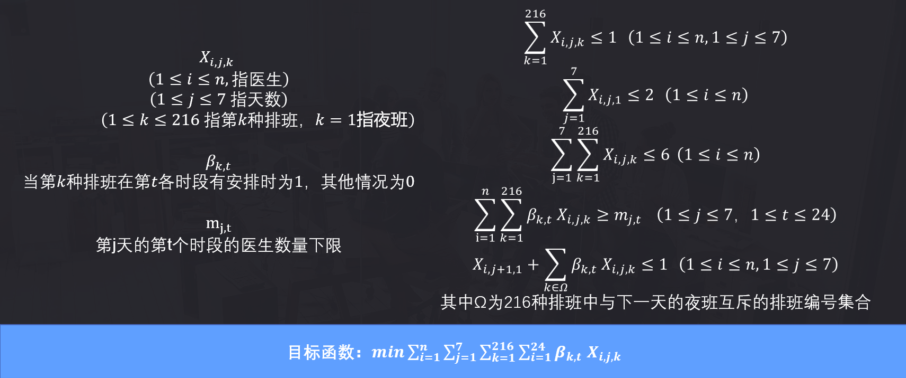
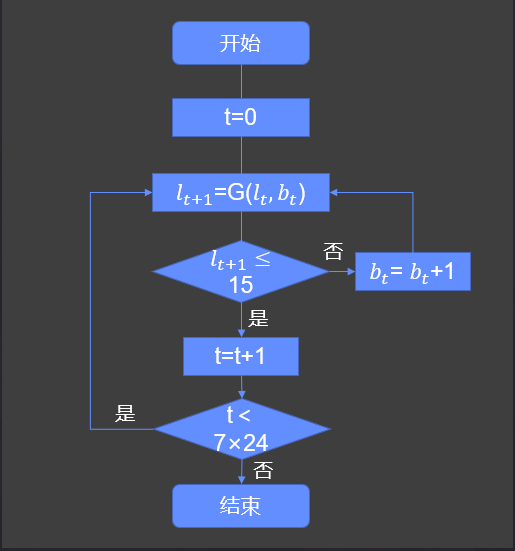

# SJTU-IO307-2022

Course project of SJTU-IO307 (Comprehensive Experiment for Industrial Engineering)

- solver_cp.py: 排班约束求解器
- bpsffa.py: 第一种队长估计
- bpsffa2.py: 第二种队长估计
- main.py: 生成各时段人数下限、求解排班和可视化

## 如何使用

运行main.py即可。main.py中可修改的部分如下：

- `pd.read_csv('lam_1.csv')`: lam_1.csv和lam_2.csv分别对应第1组和第2组输入数据。
- `lbs = gen_lbs_3(mu, lams)`: 可以使用另外两种下限生成方法，或者指定任意长度为7*24的数组。
- `count_down = 1`: 在不考虑借调成本、仅考虑总工作时间的情况下设为2可能会有更优的解。

## 思路

考虑到排班约束较为复杂，难以设计效果良好的邻域策略，同时队长约束又难以使用求解器支持的约束来高效表达，
因此约束替换是一个比较好的方案：使用各个时段的医生数量下限替代各时段末平均患者数量上限，
从而转化为一个整数线性规划问题。

排班约束可以分为两类，第一类是一天内的排班的约束，第二类是不同天之间的排班的约束。
根据第一类排班约束可以得出一名医生在一天内的排班可能性是有限的，经过计算只有216种，
因此一名医生在一天内的排班情况可以用216个0-1变量来表示，7天就是1512个0-1变量。
根据第二类排班约束可以写出关于这些决策变量的约束方程。

如何生成各个时段的医生数量下限？基本算法（`gen_lbs_1`）如下图所示：

根据排班约束可以做如下的优化（`gen_lbs_2`和`gen_lbs_3`）：

1. 把整个夜班看作一个整体
2. 白班最初四小时的下限递增
3. 白班最后四小时的下限递减

## 结果

第1组输入数据：

- 医生数量：11
- 总工作时间：539
- 借调成本：10
- 总成本：549

第2组输入数据：

- 医生数量：14
- 总工作时间：679
- 借调成本：40
- 总成本：719

如果需要具体排班图表，请运行main.py，运行后会在img文件夹下导出图表。
